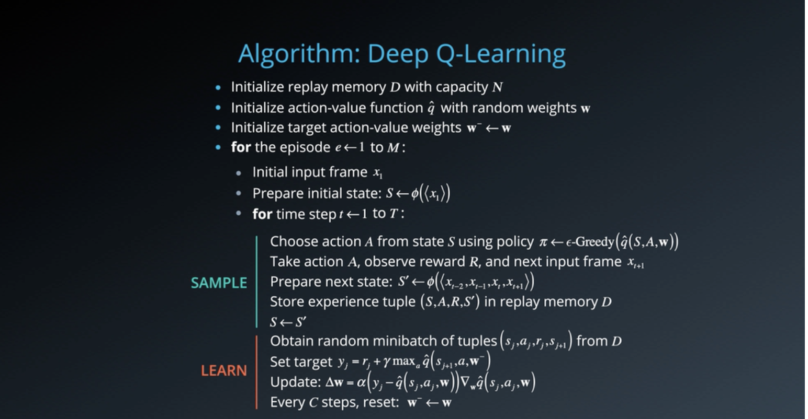
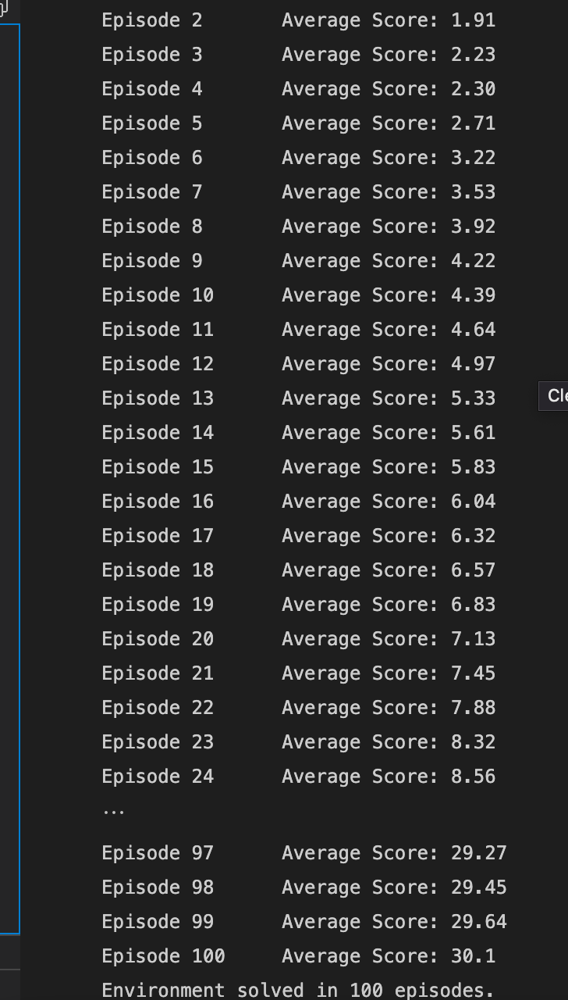
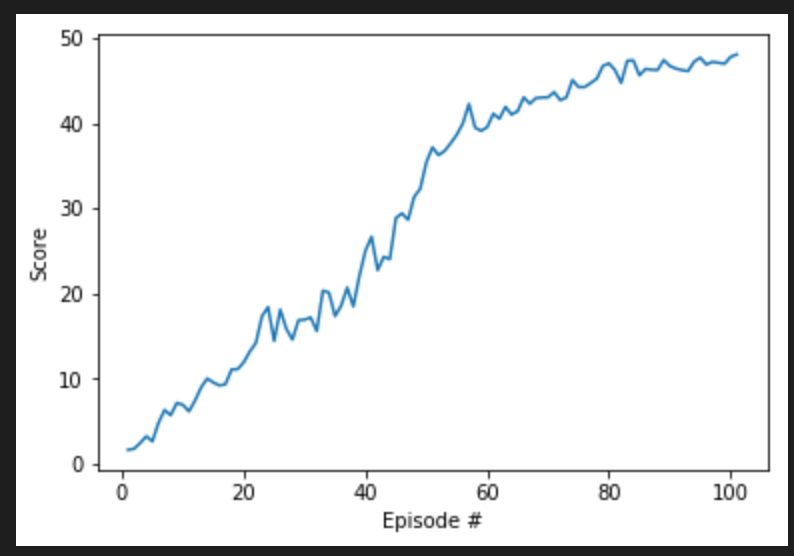

# Project 2: Continuous Control

## Introduction

In this environment, a double-jointed arm can move to target locations. A reward of +0.1 is provided for each step that the agent's hand is in the goal location. Thus, the goal of your agent is to maintain its position at the target location for as many time steps as possible.

## Environment

The observation space consists of 33 variables corresponding to position, rotation, velocity, and angular velocities of the arm. Each action is a vector with four numbers, corresponding to torque applicable to two joints. Every entry in the action vector should be a number between -1 and 1.

## Model Architecture

### Deep Q Network

Reinforcement learning is a branch of machine learning where an agent outputs an action and the environment returns an observation or, the state of the system and a reward. The goal of the agent is to best decide the course of action. Usually RL is decribed in terms of this agent interacting with a previously known environment, trying to maximize the overall reward. 

The Deep Q-Learning algorithm represents the optimal action-value function *q as a neural network (instead of a table).  

It used two features:
> - Experience Replay
> - Fixed Q-Targets

There are two ways for Deep Q Algorithm: 

Method one: Use of rolly history of the past data via replay pool. By using replay pool, the behaviour distribution is average over many of its previous states, smoothing out learning and avoiding oscillations. Experience of each state is used in many weight updates. 

Method two: Use of target network to represent old Q-dunction, which will be used to compute the loss of every action during training. At each step of the training, the Q fuction value changes and the value estimate can spiral out of control. These additions enable RL changes to converge, more reliably during training.

### Actor Critic

Actor-critic methods leverage the strengths of both policy-based and value-based methods.

Using a policy-based approach, the agent (actor) learns how to act by directly estimating the optimal policy and maximizing reward through gradient ascent. Meanwhile, employing a value-based approach, the agent (critic) learns how to estimate the value (i.e., the future cumulative reward) of different state-action pairs. Actor-critic methods combine these two approaches in order to accelerate the learning process. Actor-critic agents are also more stable than value-based agents, while requiring fewer training samples than policy-based agents.

Actor-Critic method is implemented in model.py file. This is further trained using in agent.py.

## Algorithm

### Ornstein-Uhlenbeck process

Along with above implementation we have implmented Ornstein  Uhlenbeck to add noise to the result. The Ornstein-Uhlenbeck process adds a certain amount of noise to the action values at each timestep. This noise is correlated to previous noise, and therefore tends to stay in the same direction for longer durations without canceling itself out. This allows the arm to maintain velocity and explore the action space with more continuity.

Parameters in OU process:

- mu: long running mean
- theta: speed of mean revision
- sigma: the volatility parameter

## Hyperparameters

- BUFFER_SIZE = int(1e6)  # replay buffer size
- BATCH_SIZE = 128        # minibatch size
- GAMMA = 0.99            # discount factor
- TAU = 1e-3              # for soft update of - target parameters
- LR_ACTOR = 1e-3         # learning rate of the  actor 
- LR_CRITIC = 1e-3        # learning rate of the critic
- WEIGHT_DECAY = 0        # L2 weight decay
- LEARN_TIMES = 10
- LEARN_TIMESTEPS = 20
- EPSILON = 1.0           # explore->exploit noise process added to act step
- EPSILON_DECAY = 1e-6    # decay rate for noise process

## Implementation

### model.py

Actor Critic model is implemented here.

Structure of models:

1. Input layer whose size is taken from state_size
2. Two hidden layers with 300 and 400 cells
3. Hidden layer one is Batch Normalized
4. Output layer whose side depends on the action size

### agent.py

Agent, OUNoise, ReplayBuffer are implemented here

Agent(): 

- This is a DQN agent. 
- init : state_size and action_size are defined. Adam Optimizer and QNetwork model are initialized. ReplayBuffer will be used to store the states, actions and rewards. OUnoice is initialized here
- step: Memory is added in the ReplayBuffer. A random sample is taken from ReplayBuffer memory. Method learn is called to improve the model. 
- act: best action is chosen and returned 
- learn: experience, targets, loss(mean squared error) and optimizer is used to update the weights for neural. This method is called 10 times after every 20 steps networks. Noise is reset here and epsilon is decayed as well
- soft_update: it is used to update target neural networks from local neural network

ReplayBuffer:

- init: variables are initialized
- add: experience are appended in memory
- sample: a rando sample of action, reward, states are returned
- len: length of memory is returned

OUNoise:

- init: mu, sigma and theta are initialized here
- reset: Reset the internal state (= noise) to mean (mu).
- sample: Update internal state and return it as a noise sample.

## Result

### Model training

### Plot of rewards

## Ideas for future work

Improvments which can be made:

1. Double DQN

Deep Q-Learning tends to overestimate action values. Double Q-Learning has been shown to work well in practice to help with this.

2. Prioritized Experience Replay

Deep Q-Learning samples experience transitions uniformly from a replay memory. Prioritized experienced replay is based on the idea that the agent can learn more effectively from some transitions than from others, and the more important transitions should be sampled with higher probability.

3. Dueling DQN

Currently, in order to determine which states are (or are not) valuable, we have to estimate the corresponding action values for each action. However, by replacing the traditional Deep Q-Network (DQN) architecture with a dueling architecture, we can assess the value of each state, without having to learn the effect of each action.

## References

Deep Reinforcement Learning Udacity Nanodegree